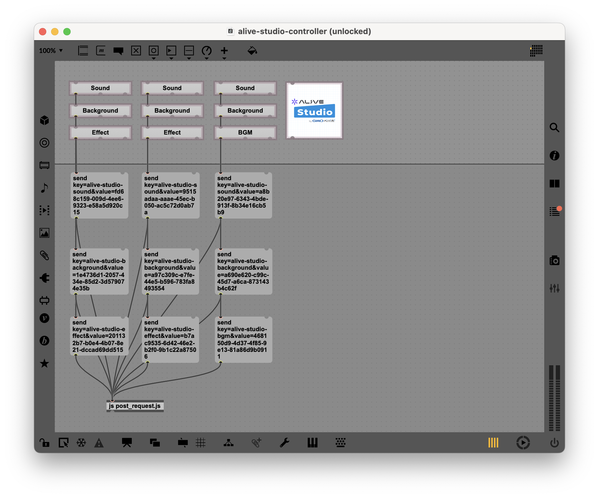

# HTTP to WebSocket Bridge for Alive Studio

HTTPリクエストをWebSocketメッセージに変換するブリッジアプリケーションです。WebSocketが直接利用できない環境から、OBSとAlive Studioへの通信を可能にします。

## 背景・目的

OBSはWebSocket通信で内部へのアクセスを可能にしています。OBSのカスタムブラウザソース上で動作するAlive Studioは、WebSocketから受け取った特定の通信方法での通信に基づいて内部状態を変更します。

しかし、技術的な制約などによりWebSocketが直接利用できない環境があります。このプロジェクトは、そのような環境でもREST APIを通じてOBS/Alive Studioと通信できるようにするためのブリッジアプリケーションです。

## ユースケース

主なユースケースの一つとして、**Max for Live**があります。[./examples/alive-studi-controller/](./examples/alive-studio-controller/)に実装例があります。

Max for Liveからは以下のようなコードでHTTPリクエストを送信できます：

```javascript
function send(params) {
  var xhr = new XMLHttpRequest();
  xhr.open("POST", "http://localhost:5001/send", true);
  xhr.setRequestHeader("Content-Type", "application/x-www-form-urlencoded");
  xhr.send("url=" + encodeURIComponent(params));
}
```

そして下図のように上記のスクリプトにリクエスト内容を送信すると、WebSocketメッセージに変換してOBS/Alive Studioへ転送します。このようにして、WebSocketが使えない環境からもAlive Studioへの操作ができるようになります。



## インストール

```bash
# リポジトリをクローン
git clone https://github.com/kentaro/alive-studio-http2ws.git
cd alive-studio-http2ws

# 依存関係をインストール
npm install
```

## 環境設定

`.env`ファイルを作成し、以下の変数を設定します：

```
OBS_PORT=4455                  # OBS WebSocketサーバーのポート
OBS_PASSWORD=********          # OBS WebSocketサーバーのパスワード
SERVER_PORT=5001               # このアプリケーションのポート番号
```

## 使用方法

### サーバーの起動

```bash
# 開発モード（自動再起動あり）
npm run dev
```

### APIエンドポイント

#### パラメータ送信

```
POST /send
```

リクエスト形式:

```json
{
  "key": "background",
  "value": "blue"
}
```

または

```json
{
  "url": "background=blue&sound=on"
}
```

Max for Liveなどからは、Content-Type: application/x-www-form-urlencodedで以下のように送信できます：

```
url=background=blue&sound=on
```

## 貢献

1. Forkする
2. 機能ブランチを作成する（`git checkout -b feature/amazing-feature`）
3. 変更をコミットする（`git commit -m 'Add some amazing feature'`）
4. ブランチをPushする（`git push origin feature/amazing-feature`）
5. Pull Requestを作成する

## 著者

Kentaro Kuribayashi

## ライセンス

MIT
